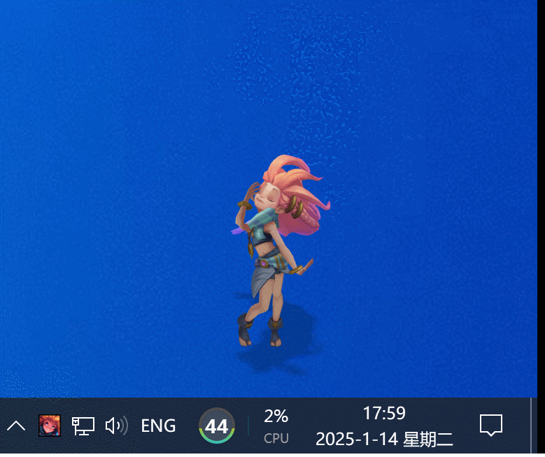
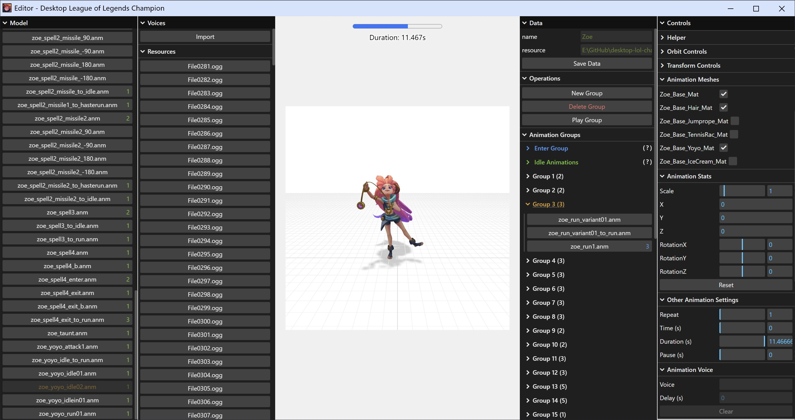

# Desktop League of Legends Champion (with Editor)

Display a **League of Legends** model on the screen.

- With character **animation**s
- With character **voice**s
- With a model data **Editor**



## Editor

You can extract the character **model** and **voice**s of **League of Legends**, and then build your own model data. Please refer to the [**wiki**](https://github.com/ssnangua/desktop-lol-champion/wiki) for details.



## Development

Get the sample character **model** and **voice**s from [**Releases**](https://github.com/ssnangua/desktop-lol-champion/releases).

Or extract the character **model** and **voice**s from **League of Legends** and generate the `.glb` file yourself. Please refer to the [**wiki**](https://github.com/ssnangua/desktop-lol-champion/wiki) for details.

```bash
# install
cd src
npm install
cd ..
npm install

# dev
npm run dev

# build
npm run build
```

## See Also

- [NW.js](https://nwjs.io/)
- [three.js](https://threejs.org/)
